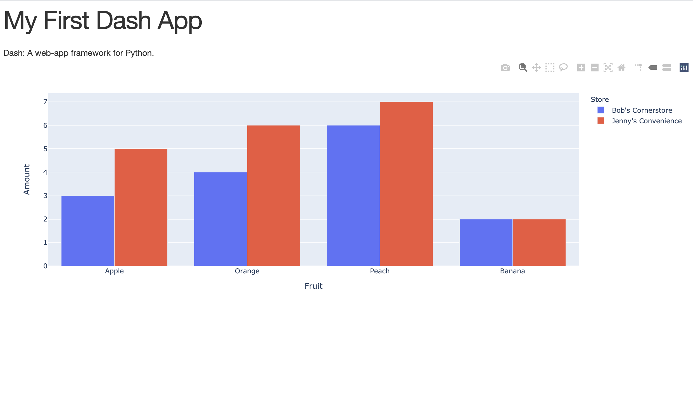

### Install Dash

```
pip install dash
```

### Create file called `app.py` containing the following code

```
import dash
import dash_core_components as dcc
import dash_html_components as html
import plotly.express as px
import pandas as pd

# import an external stylesheet, will be a CSS file
external_stylesheets = ['https://codepen.io/chriddyp/pen/bWLwgP.css']

# set up the reference to our Dash Application and link to external style
app = dash.Dash(__name__, external_stylesheets=external_stylesheets)

# create some data to plot
df = pd.DataFrame({
    "Fruit":["Apple", "Orange", "Banana", "Orange", "Peach", "Apple", "Peach", "Banana"],
    "Amount":[3, 6, 2, 4, 6, 5, 7, 2],
    "Store":["Bob's Cornerstore", "Jenny's Convenience", "Jenny's Convenience", "Bob's Cornerstore", "Bob's Cornerstore", "Jenny's Convenience", "Jenny's Convenience", "Bob's Cornerstore"]
})

# create bar plot from our newly created data
# see https://plotly.com/python/px-arguments/ for more options
fig = px.bar(df, x="Fruit", y="Amount", color="Store", barmode="group")

# LAYOUT, will hold all of our application "structure"
app.layout = html.Div(children=[
    html.H1(children='My First Dash App'),

    html.Div(children='''
        Dash: A web-app framework for Python.
    '''),

    dcc.Graph(
        id='example-graph',
        figure=fig
    )
])

if __name__ == '__main__':
    # open server and host app
    # tell Dash to refresh our browser every time we make a code change
    app.run_server(debug=True)
```

- The `layout` is composed of a tree of "components" like `html.Div` and `dcc.Graph`.
- `dash_html_components` library has a component for every HTML tag. `html.H1(children='Hello Dash')` component generates a `<h1>Hello Dash</h1>` HTML element in your application.
- Not all components are pure HTML. `dash_core_components` describe higher-level components that are interactive and are generated with JavaScript, HTML, and CSS through the React.js library.
- Each component is described entirely through keyword attributes. Dash is declarative: you will primarily describe your application through these attributes.
- The children property is special. By convention, it's always the first attribute which means that you can omit it: html.H1(children='Hello Dash') is the same as html.H1('Hello Dash'). Also, it can contain a string, a number, a single component, or a list of components.

### In the terminal, run our `app.py` script using the `python app.py`

You'll see the following output indicating our app is running:

```
Dash is running on http://127.0.0.1:8050/

 * Serving Flask app "app" (lazy loading)
 * Environment: production
   WARNING: This is a development server. Do not use it in a production deployment.
   Use a production WSGI server instead.
 * Debug mode: on
```

### Copy and paste the URL provided (at top of output after `python app.py` command: "Dash is running on \_\_\_\_") into the browser to view our `app.py` dashboard


